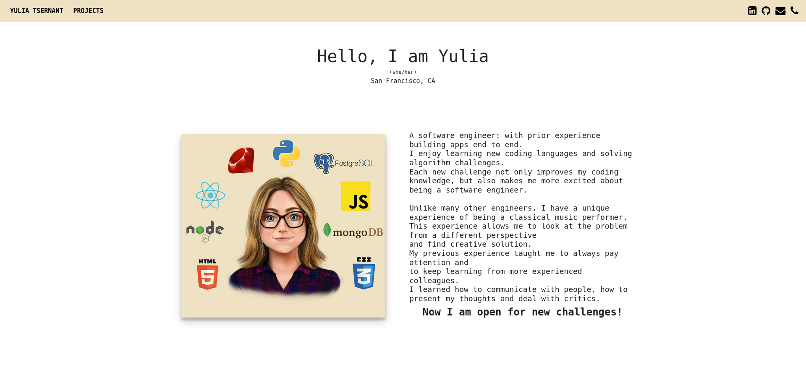

# Personal portfolio website

Created portfolio with my projects and bio

## Projects Listed
* Global Life

Mobile application for Android that displays local direct numbers of rescue services in the location of the device and allows to call these services.
Created with JavaScript, Node.js, React Native, MongoDB, CSS3, Bcrypt.

* Wayfarer

Projects where you can travel to all cities of your dream. User can create an account and travel through fantasy cities and write posts.
Created with JavaScript, Node.js, React, MongoDB, AWS SES, AWS S3, CSS3, Bcrypt, Semantic UI.

* Pinrecipe

Developed an app where users an safely store their favorite recipes and browse for new ones by category: breakfast, lunch, dinner, dessert. HTML5, CSS3, Javascript, Bootstrap, Jquery, Mongoose, Express MongoDB, NodeJS, Bcrypt.

* Synesthesia

Created an app where user with synesthesia (a phenomenon where somebody listening to music associates it with various colors) can listen to musical notes, pick colors or art that user associates with note. Python, Django, PostgreSQL, HTML5, CSS3, Bootstrap.

* PawBall Game

Released a game where a chain of 10-20 balls of different colors start to roll around the screen. Eliminate all of the balls before they make a circle and came back to the starting point. HTML5, CSS3, JavaScript and SVG.

* Memory Game

A card game in which all of the cards are laid face down on a surface and two cards are flipped face up over each turn. The object of the game is to turn over pairs of matching cards.
HTML5, CSS3, JavaScript.

## Project Planned
* Feedback Tracker.

App for providing feedback for students' progress at General Assembly Academy

* GA Time Converter

Website with all General Assembly timezones that displays local time for different campuses.
(https://ga-time.github.io/)