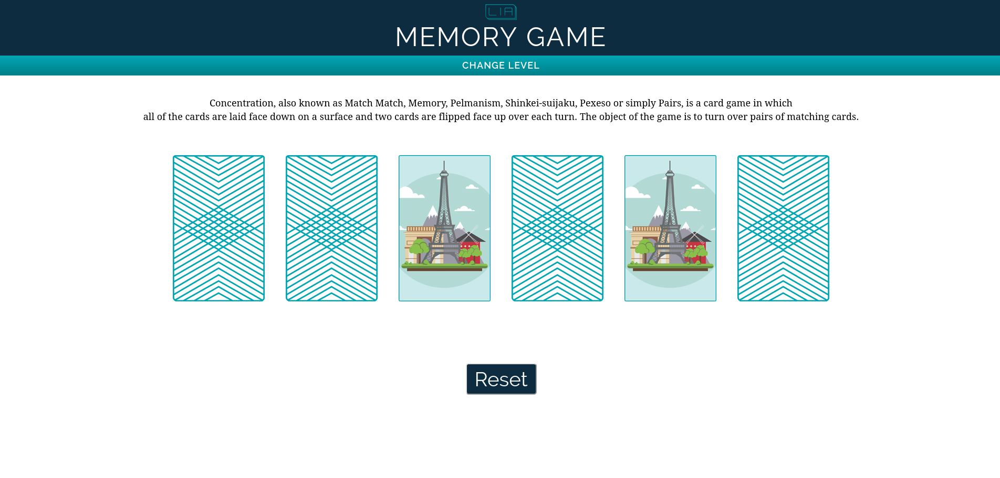

# Memory Card Game

A card game in which all of the cards are laid face down on a surface and two cards are flipped face up over each turn. The object of the game is to turn over pairs of matching cards.

## Technologies Used:
* JavaScript
* HTML5
* CSS3

## Play the Game
<https://liatsernant.github.io/memory_game/>