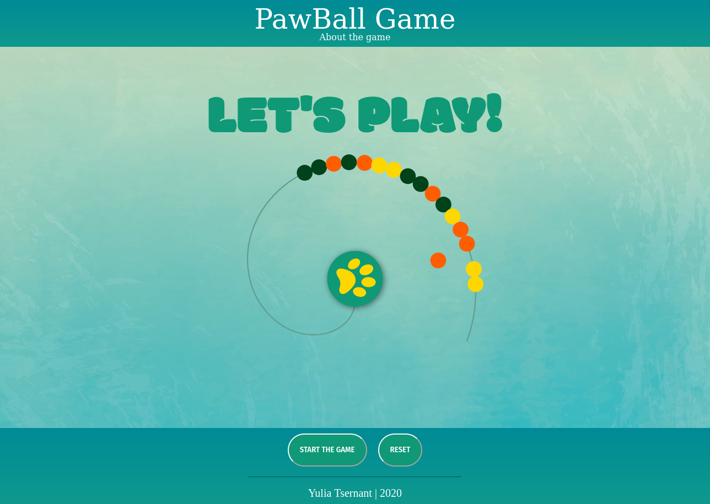
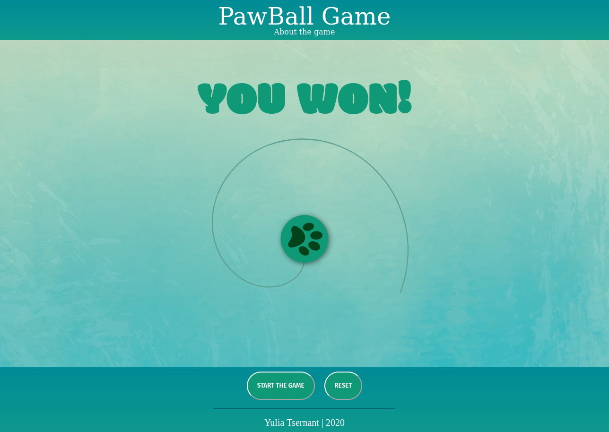
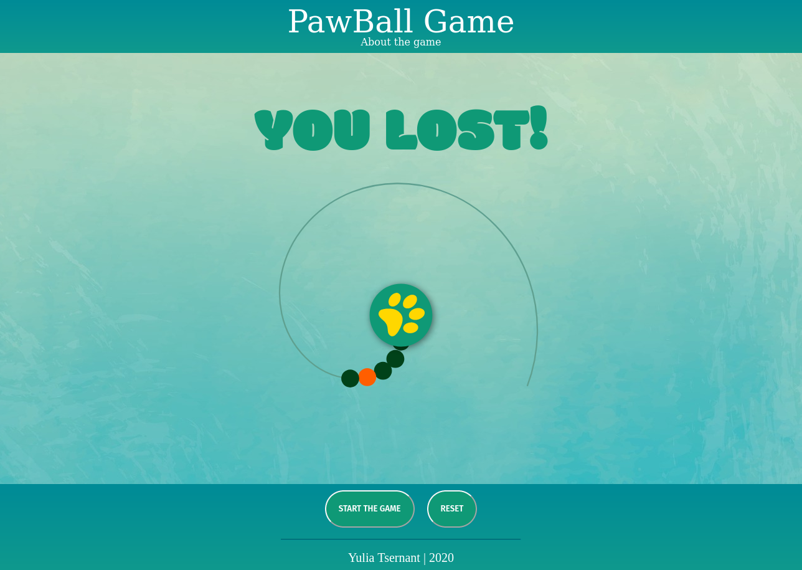
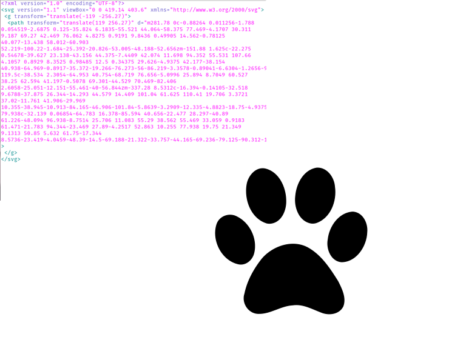

# PawBall Game

### Thanks:
* Allen Wright
* Brock Whitbread-Cole
* Carson Butterfield

for the help finding inspiration and creating this first GA project.
# Description

PawBall is a tile-matching puzzle game.
The challenge is:
Chain of diffecent color balls start to roll around the screen. 

Eliminate all of the balls before they make a circle and return to the starting point.

User has a paw on the middle of the screen with a ball of a random color.  
When user sees more than two balls of the same color in a row that match the paw’s available color, user can shoot and remove these balls from the board.  
If user removes all balls before they make a circle and return to the starting poin - user **wins** the game.

If user cannot remove all balls before they make a circle and return to the starting point - user **loses** the game.

## Why PawBall?
The original version of PawBall is ***Zuma*** game. It inspired me to make my own version of the game for the first project.  
I used to play Zuma when I was a kid. I thought it would be a great idea to understand how my favorite game works from the inside.

## Technologies I used
### 
* HTML
* CSS
* SVG
* JavaScript

I used HTML/CSS and JavaScript before I took SVG for extra challenge. 
* SVG has slightly different approach.

* During the building my project I found SVG very usefull for animation.

* First I planned to use coordinates, but then I decided to use timing.  
For my implementation it means that the path cannot be curved.

* I decided to avoid using classes and classes interaction for making my life slightly easier.

## Next Features:
* Make the game small-screen friendly.
* Make the game stable for using in different browsers.
* Fix graphic problems when user shoot the place of just deleted ball.

## Requirements and Link
**Firefox**  
Game: https://liatsernant.github.io/pawBallGame/

#
## Contacts
The game (Firefox only!): https://liatsernant.github.io/pawBallGame/  
E-mail: yulia.tsernant@d-d.me  
Github: https://git.generalassemb.ly/LiaTsernant