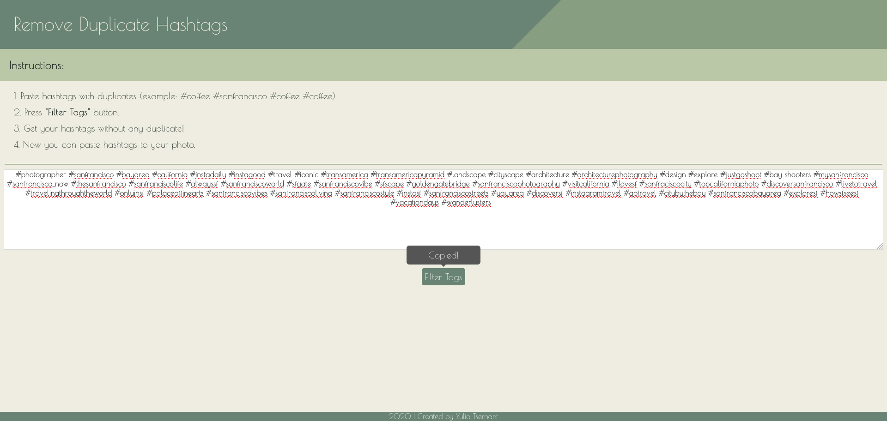
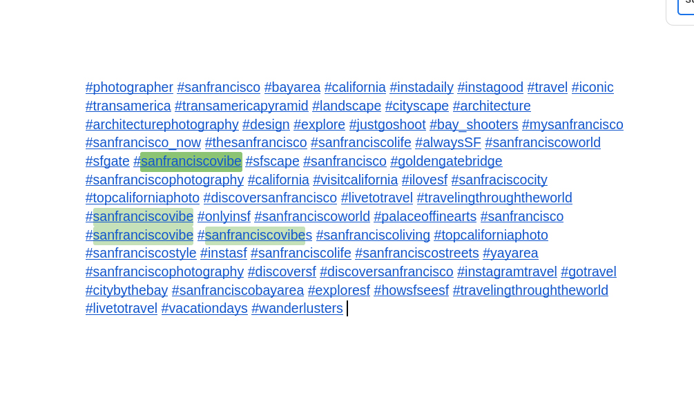

# Tags Filtering

While I was working with Instagram account of a cafe and did a research on hashtags that we need to use for user engagement with an account, I had to filter manually all duplicate hashtags.

Solved problem by creating an app that takes all hashtags and filter out duplicates. 
Saved ~20% of time while working on optimization of Instagram account statistic.

## Technologies Used:
- JavaScript
- HTML
- CSS

## See the App:
<https://liatsernant.github.io/tagsFiltering/>

### Sample tags with duplicates to filter:
#### #instadaily #instagood #travel #iconic #transamerica #transamericapyramid #landscape #cityscape #architecture #architecturephotography #design #explore #justgoshoot #bay_shooters #mysanfrancisco #sanfrancisco_now #thesanfrancisco #sanfranciscolife #alwaysSF #sanfranciscoworld #sfgate #sanfranciscovibe #sfscape #sanfrancisco #goldengatebridge #sanfranciscophotography #california #visitcalifornia #ilovesf #sanfraciscocity #topcaliforniaphoto #discoversanfrancisco #livetotravel #travelingthroughtheworld #sanfranciscovibe #onlyinsf #sanfranciscoworld #palaceoffinearts #sanfrancisco #sanfranciscovibe #sanfranciscovibes #sanfranciscoliving #topcaliforniaphoto #sanfranciscostyle #instasf #sanfranciscolife #sanfranciscostreets #yayarea #sanfranciscophotography #discoversf #discoversanfrancisco #instagramtravel #gotravel #citybythebay #sanfranciscobayarea #exploresf #howsfseesf #travelingthroughtheworld #livetotravel #vacationdays⁣⁣⁣⁣ #wanderlusters ⁣
